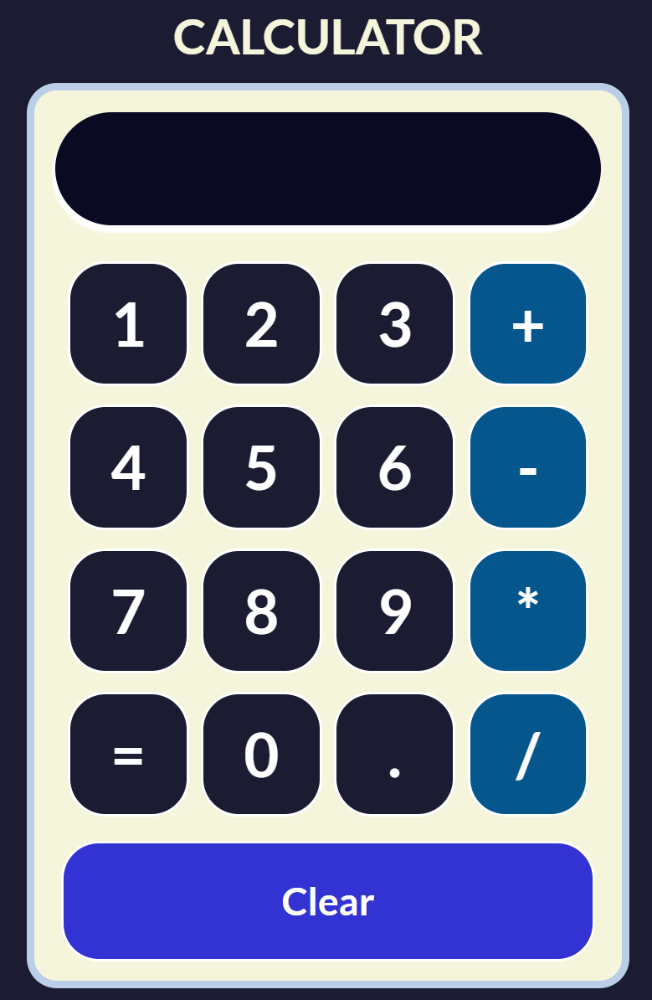

# Calculator

Este proyecto es una pequeña calculadora interactiva construida con **React**, **Vite** y **JSX**.  
La aplicación permite realizar operaciones básicas, el resultado se muestra en un input a modo de pantalla.

**Calculator** está disponible para su visualización en el siguiente enlace:
https://mabel-gp.github.io/calculator/

## 🛠️ Tecnologías utilizadas

- React + Vite
- JavaScript (JSX)
- CSS

## ✨ Funcionalidades

- Operaciones básicas: suma, resta, multiplicación y división.

- Interfaz interactiva.

- Diseño amigable y fácil de usar.

## 📝 Aprendizajes

Durante este proyecto, he aprendido:

**- Uso de React:** Profundicé en la creación de componentes reutilizables y en la gestión del estado utilizando useSate.

**- Desarrollo con Vite:** Aprendí cómo configurar y optimizar proyectos en Vite para un rendimiento más rápido en el entorno de desarrollo.

**- Componentes Interactivos:** Experimenté con la creación de componentes que responden a la interacción del usuario, como el el Botón Clear.

## 👁‍🗨 Vista Previa

    

¡Gracias por ver!
